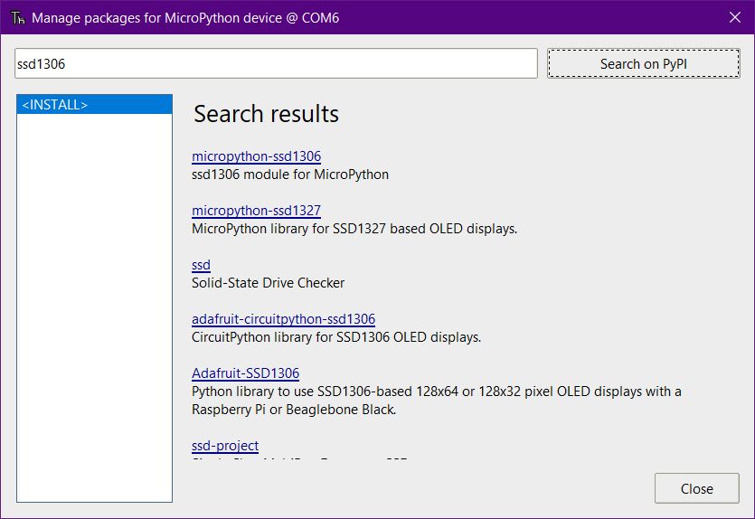
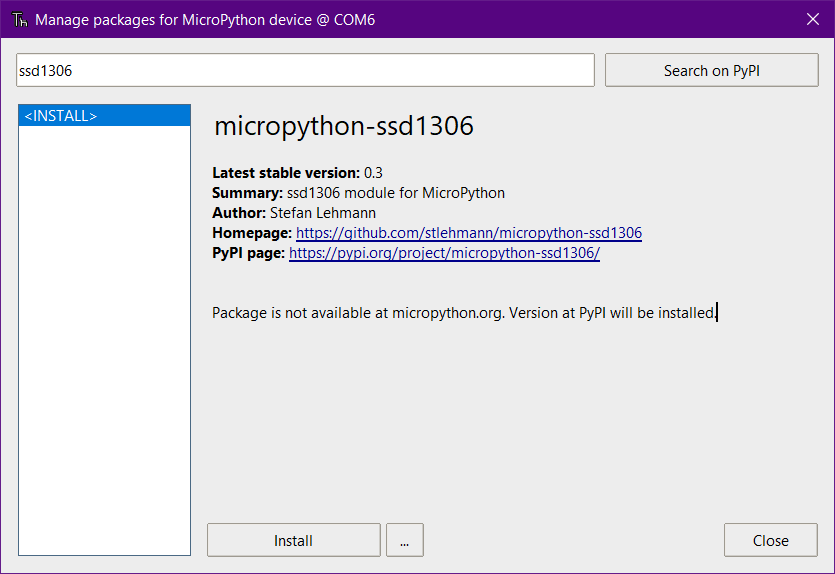

# Lab 1: Introduction to MicroPython
[Hello World](https://en.wikipedia.org/wiki/%22Hello,_World!%22_program) is a classic first program for many programming languages. It's simple to write, usually only a line or two. All it does is print "Hello World" on a monitor or other display.

In this lab, we'll start with a simple, one-line program to print Hello World! in the Thonny window. Then, we'll enhance it to use the built-in OLED display. Finally, we'll print the CPU temperature as an example of how to print more than just text.

## Printing Hello World
Here's a Hello World in Python:

```
message = "Hello World!"
print(message)
```

It works exactly the same in MicroPython. Here's how you can run it:

1. Copy and paste the code above into the Thoni editor window.
2. Save the file as hello.py
   * In Thonny, click File > Save As.
   * Choose _MicroPython Device_ when asked where to save.
   * Name the file _hello.py_.
   * Click OK.
3. Click the green play button icon to run the program.
4. Wait a moment then verify you see Hello World! displayed at the bottom in Thonny's shell window.

Figure out how you could change the message to say "Hello MicroPython!" and update the code.

## Printing to the Built-In Display
Writing Hello World to the microcontroller's built-in display requires a few extra lines of code. That's because there's a bit of work to do setting up the display before it's ready to receive any text.

In its simplest form, Hello World on the microcontroller looks like this:

```
from machine import Pin, SoftI2C
from ssd1306 import SSD1306_I2C
message = "Hello MicroPython!"
i2c = SoftI2C(scl=Pin(4), sda=Pin(5))
oled = SSD1306_I2C(128, 64, i2c)
oled.text(message, 0, 0)
oled.show()
```

You can copy this to a new Thonny editor window and save it as _hello-oled.py_ But, when you try to run it the first time, you'll get an error in the Thonny editor's shell window that looks like this:

```
Traceback (most recent call last):
File "<stdin>", line 2, in <module>
ImportError: no module named 'ssd1306'
```

That's because _ssd1306_, referred to on line 2 of the program, does not exist yet. It's extra code not included with the Thonny editor, called a package. To use the functions in ssd1306, you'll need to download and install the package first.

> As you write more and more complex programs, you'll find you often need packages like this to get your program to do what you want.

You can use Thonny to find and install packages. Here's how:
1. Click the _Tools_ menu and select _Manage Packages_.
2. In the search field, type `ssd1306` and click _Search on PyPi_. [Figure 1]
3. Click on the _micropython-ssd1306_ search result.
4. Click _Install_. [Figure 2]

Run the program again and verify that Hello World! shows up on the ESP32's display.

## Screenshots



_Figure 1: Results of searching for ssd1306_



_Figure 2: The MicroPython version of ssd1306_

## A Detailed Look at MicroPython Hello World OLED
The program above takes six lines to display Hello World. Most examples of Hello World, including standard Python, only need one line. So why does MicroPython need six?

Let's look at the program, line by line.

`from machine import Pin, SoftI2C`

This tells MicroPython we'll be using code from a package called _machine_ and specifically the _Pin_ and _SoftI2C_ functions in that package. This sets up communication between the ESP32 and the driver chip for the display using an established communications protocol called [I2C](https://en.wikipedia.org/wiki/I%C2%B2C) (eye squared sea).

`from ssd1306 import SSD1306_I2C`

This is pulling in the SSD1306_I2C function from the ssd1306 package. You can probably guess from the name _SSD1306_I2C_ that this function is for interacting with the SSD1306 display driver using I2C communication.

`message = "Hello MicroPython!"`

This sets the message variable to _Hello MicroPython!_ It's the only line re-used from the first Hello World! example. 

`i2c = SoftI2C(scl=Pin(4), sda=Pin(5))`

This line sets up I2C communication using pins 4 (clock) and 5 (data) on the microcontroller. `i2c` is an object variable that represents the particular I2C bus being used (It's possible to have more than one and with different pins.) The `i2c` variable is needed in the next line of the program so the SSD_1306_I2C function knows where to send its I2C commands and data.

`oled = SSD1306_I2C(128, 64, i2c)`

Here we're creating another object, this one called _oled_, that we'll use whenever we want to interact with the display. When we create it, we're sending the width and height of the display (128 and 64) along with a reference to the _i2c_ object we created previously.

`oled.text('Hello World!', 0, 0)`

Now that everything is set up, we can finally send a Hello World message to the display. But, the message is only in the [framebuffer memory](https://en.wikipedia.org/wiki/Framebuffer) at this point. There's one more step needed to make it appear.

`oled.show()`

This final step copies the framebuffer memory to the display memory so the mesage will show on the display.

## Displaying CPU Temperature
Since we're building a smart thermostat, we'll need to figure out how to read data, like temperature, and show it on the display.

The ESP32 has a built-in temperature sensor that we can read. Here's the code to do it:

```
from esp32 import raw_temperature
cpu_temp = raw_temperature()
message = "CPU temp: {:d} F".format(cpu_temp)
print(message)
```

Create a new editor window in Thonny (File > New) and paste the code above into the blank window. Save the program as _cpu-temperature.py_ and run it.

The CPU temperature will be displayed in the Thonny shell window, along with _F_ to indictate Fahrenheit.

Now that you know how to read CPU temperature, figure out what parts of _cpu-temperature.py_ can be combined with _hello-oled.py_ to display the CPU temperature on the built-in display.

For an extra challenge, see if you can display Hello MicroPython! and CPU temperature at the same time. Hint: the 0, 0 at the end of `oled.text('Hello World!', 0, 0)` indicates the X, Y coordinate where the message starts.

## Next Steps
CPU temperature is the same as ambient room temperature, so the ESP32's internal temperature sensor can't be used to determine if the heat should be switched on or off. To do that, we'll need to get the temperature from a sensor that's not sitting right next to the warm CPU. The next lab shows how a commonly available DHT11 temperature and humidity sensor can be used for this task.
